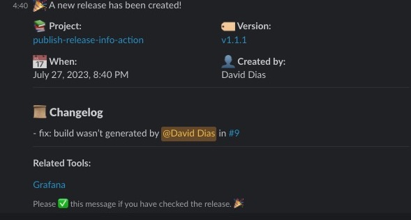

# Release notification (Action)

[](https://github.com/thedaviddias/publish-release-info-action/actions/workflows/check-dist.yml)
[](https://github.com/thedaviddias/publish-release-info-action/actions/workflows/build-test.yml)

A GitHub Action that sends release notifications to Slack, integrating with JIRA, Sentry, and Grafana.

## Usage

### Screenshot of the Slack notification


### Create Workflow

To use this GitHub Action, you need to create a workflow file (e.g., ``.github/workflows/deploy.yml``) in your repository. Here's an example workflow that runs when a tag matching the pattern `v[0-9]+.[0-9]+.[0-9]+` is pushed:

```yaml
name: Deploy to production

on:
  push:
    # Push/tags only work if you manually created the tag/release using Github GUI
    tags:
      - "v[0-9]+.[0-9]+.[0-9]+"

jobs:
  release:
    permissions:
      contents: read
      pull-requests: write

    runs-on: ubuntu-latest

    steps:

      - name: Release Notification
        uses: thedaviddias/publish-release-info-action@vX.X.X
        with:
          github_token: ${{ secrets.GITHUB_TOKEN }}
          slack_webhook_urls: https://hooks.slack.com/services/XXXXXX/XXXXX/XXXXXXX
          jira_ticket_prefix: ABC
          jira_instance_url: https://your-jira-instance.com
          sentry_project_name: MyProject
          sentry_project_id: "1234"
          grafana_dashboard_link: https://grafana.com/dashboards/XXXX
          contributor_replace_regex: "-"
          contributor_replace_char: "."
          time_zone_offset: "-4" # Toronto (Canada - Ontario)
```

#### Inputs

| Name                        | Required | Default                     | Description                                                                                               |
| --------------------------- | -------- | --------------------------- | --------------------------------------------------------------------------------------------------------- |
| `github_token`              | yes      |                             | Token to use to authorize label changes. Typically the GITHUB_TOKEN secret                                |
| `repo`                      | no       |                             | Name of the repo (e.g. owner/repo) if not the current one                                                 |
| `tag_regex`                 | no       | ^v[0-9]+\\.[0-9]+\\.[0-9]+$ | Regex to accommodate varying tag formatting                                                               |
| `time_zone_offset`          | no       | 0                           | Timezone offset in minutes from UTC.                                                                      |
| `contributor_replace_regex` | no       |                             | Regular expression (regex) pattern to identify characters in the `contributor` name that will be replaced |
| `contributor_replace_char`  | no       |                             | The character that will replace specific characters in the `contributor` name                             |
| `slack_webhook_urls`        | no       |                             | Slack webhook URL to receive release notifications                                                        |
| `jira_ticket_prefix`        | no       |                             | Prefix for JIRA ticket references in PR titles (e.g. ABC)                                                 |
| `jira_instance_url`         | no       |                             | URL for your JIRA instance to generate JIRA ticket links (e.g. https://your-jira-instance.com)            |
| `sentry_project_name`       | no       |                             | ID of the Sentry project for error tracking                                                               |
| `sentry_project_name`       | no       |                             | Name of the Sentry project for error tracking                                                             |
| `grafana_dashboard_link`    | no       |                             | Link to the Grafana dashboard for monitoring                                                              |


### Outputs

The is the list of the outputs. You can use another action and format the way you want.


```json
{
  "repo": "",
  "repoLink": "",
  "releaseVersion": "",
  "releaseLink": "",
  "currentTagCommit": {
    "url": "",
    "author": {
      "name": "",
      "email": "",
      "date": ""
    }
  },
  "prList": [
    {
      "contributor": "",
      "prTitle": "",
      "prUrl": "",
      "prNumber": 0
    }
  ]
}
```

## Examples

### Example Workflow (Minimum Configuration)

```yaml
name: Deploy to production

on:
  push:
    tags:
      - "v[0-9]+.[0-9]+.[0-9]+"

jobs:
  release:
    permissions:
      contents: read
      pull-requests: write
    runs-on: ubuntu-latest
    steps:
      - name: Release Notification
        uses: thedaviddias/publish-release-info-action@vX.X.X
        with:
          github_token: ${{ secrets.GITHUB_TOKEN }}

```

### Example Workflow with Custom Slack template

We can use the output from `publish-relase-info-action` and use in combinaison with other actions like [slack-send](https://github.com/marketplace/actions/slack-send) in case you want to use a custom notification template.

```yaml
name: Deploy to production

on:
  push:
    tags:
      - "v[0-9]+.[0-9]+.[0-9]+"

jobs:
  release:
    permissions:
      contents: read
      pull-requests: write
    runs-on: ubuntu-latest
    steps:
      - name: Release Notification
        uses: thedaviddias/publish-release-info-action@vX.X.X
        id: release
        with:
          github_token: ${{ secrets.GITHUB_TOKEN }}
          time_zone_offset: "+5"

      - name: Post to a Slack channel
        uses: slackapi/slack-github-action@v1.24.0
        env:
          SLACK_BOT_TOKEN: ${{ secrets.SLACK_BOT_TOKEN }}
        with:
          channel-id: 'CHANNEL_ID'
          payload: |
            {
              "text": "New release!",
              "blocks": [
                {
                  "type": "section",
                  "fields": [
                    {
                      "type": "mrkdwn",
                      "text": "*Project:*\n<${{ steps.release.outputs.repoLink }}|${{ steps.release.outputs.repo}}>",
                    },
                    {
                      "type": "mrkdwn",
                      "text": "*Version:*\n<${{ steps.release.outputs.releaseLink }}|${{ steps.release.outputs.releaseVersion }}>",
                    }
                  ]
                }
              ]
            }

```

## Contributors

<!-- ALL-CONTRIBUTORS-LIST:START - Do not remove or modify this section -->
<!-- prettier-ignore-start -->
<!-- markdownlint-disable -->

<!-- markdownlint-restore -->
<!-- prettier-ignore-end -->

<!-- ALL-CONTRIBUTORS-LIST:END -->

## Licence

This GitHub Action is licensed under the [MIT License](./LICENSE).
